<!-- Generated by GitHub Profile Agent Console. Edit profile.config.json, then run npm run generate. -->

  <picture>
    <source media="(max-width: 760px) and (prefers-color-scheme: dark)" srcset="./assets/hero/agent-console-7d77147a-mobile-dark.svg">
    <source media="(max-width: 760px)" srcset="./assets/hero/agent-console-7d77147a-mobile-light.svg">
    <source media="(prefers-color-scheme: dark)" srcset="./assets/hero/agent-console-7d77147a-dark.svg">
    <source media="(prefers-color-scheme: light)" srcset="./assets/hero/agent-console-7d77147a-light.svg">
    
  </picture>

  
  
  

## About Me

B.Tech Math & Computing student (2028) at Punjab Engineering College, with a minor in Quantum Computing.

Focused on competitive programming, quantitative finance research, and machine learning projects.

## Current Focus

| Area | What I am exploring |
| --- | --- |
| **Competitive Programming** | Solving algorithmic problems on Codeforces, spanning DP, greedy, game theory, and geometry. |
| **Quant Finance** | Developing and backtesting alpha signals on WorldQuant Brain using Fast Expression Language. |
| **Machine Learning** | Building ML pipelines for classification, time-series prediction, and sentiment analysis. |

## Featured Work

| Project | Focus | Why it matters |
| --- | --- | --- |
| [**StockLSTM**](https://github.com/Dkhgg07/Stock_Price_Predition_Sentiment_LSTM) | LSTM stock price prediction | LSTM and sentiment-driven stock price prediction served through FastAPI and Streamlit. |
| [**Stratum**](https://github.com/Dkhgg07/Stratum) | Python project | A Python project exploring algorithmic and data workflows. |
| [**HRMS_Orchestrator**](https://github.com/Dkhgg07/HRMS_Orchestrator) | JavaScript project | An orchestration project for HR management workflows. |

## Research Direction

Exploring predictive alpha expressions on WorldQuant Brain in Fast Expression Language, focusing on reversal, volatility, and cross-sectional signals for equity markets.

## Tech Stack

`C++` · `Python` · `FastAPI` · `Streamlit` · `PyTorch` · `TensorFlow` · `SQL`

## Recent Activity

<!-- AUTO:ACTIVITY:START -->
_Recent public activity will appear here after the workflow runs._
<!-- AUTO:ACTIVITY:END -->

---

  Thanks for stopping by — let's connect!

